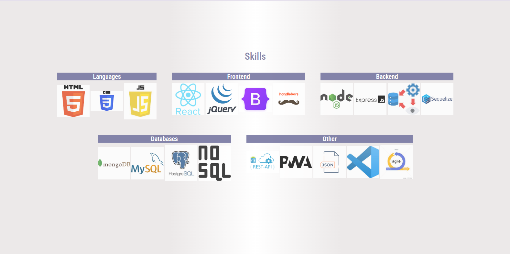

# my-portfolio

## Description

My Portfolio. Welcome!

## Table of Content
  - [Description](#Description)
  - [Process](#Process)
  - [Links](#Links)
  - [Usage](#Usage)
  - [License](#License)
  - [Contribution](#Contribution)
  - [Acknowledgement](#Acknowledgement)
  - [Questions](#Questions)

## Process

The process included creating four sections: 'About, Skills, Projects, Contact'. The nav bar includes links to each section. In the about section, my name, a short bio, and my picture is included. The skills display pictures of each program I am familiar with. The projects section showcases each project and allows for a clickable link to see each project. The contact section shows my email, phone number, and address. The styling was done with Bootstrap and CSS. I wanted a polished and sophisticated look but with a bit of color as well. The use of box-shadows added more color as well. The font is imported from Google Fonts, and variables were used to reuse color throughout the application.

## Links

Link to portfolio: https://logan-new.github.io/my-portfolio/

## Usage

A portfolio to display my work.

## License

MIT

## Contribution
  
Contact me by email provided in the Questions section.

## Acknowledgement

Project was done by the knowledge learned from Vanderbilt bootcamp.

## Questions
  
Contact with questions at:
  
Email: logannew53@icloud.com  
Click [here](https://github.com/Logan-New) for Github account.
